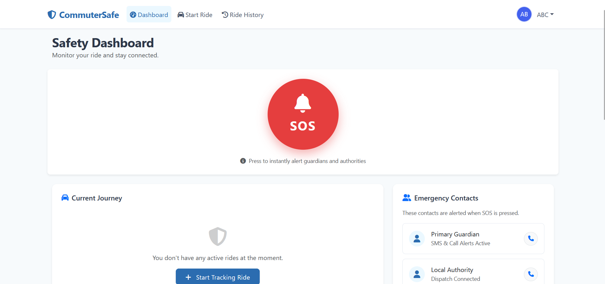

# SafeRide - Women's Safety Web Application

SafeRide is a full-featured web app made with Django that aims to make commuting safer for women. It has background location tracking, proactive safety tools, and an emergency SOS system to make sure users can get help when they need it most.

## Features

- **Live GPS Tracking**: It uses HTML5 Geolocation API to fetch and post background GPT coordinates to the server during an active ride. 
- **De-escalation Tools**: It features a realistic “Fake Call” simulation UI to de-escalate uncomfortable situations.
- **Emergency SOS Dashboard**: A clean and minimalist dashboard featuring a large, easily accessible SOS button.
- **Administrative Portal**: Comprehensive backend panel for guardians and admins to track rider progress and respond to emergencies.
- **Robust User Management**: The backend automatically handles user profiles and automatically provisions a Commuter profile if absent, ensuring maximum uptime and stability.

## Tech Stack

- **Backend**: Django (Python)
- **Database**: SQLite3 (Simplifies setup and deployment)
- **Frontend**: HTML5, Vanilla JavaScript, DOM Manipulation, CSS (Bootstrap 5 for styling)
- **APIs**: HTML5 Geolocation API

## Prerequisites

- Python 3.8+
- pip (Python package installer)

## Setup & Installation

Follow these steps to get your development environment running:

1. **Clone the repository:**
   ```bash
   git clone https://github.com/yourusername/saferide.git
   cd saferide
   ```

2. **Create a virtual environment (Recommended):**
   ```bash
   python -m venv venv
   ```

3. **Activate the virtual environment:**
   - On Windows:
     ```bash
     venv\Scripts\activate
     ```
   - On macOS and Linux:
     ```bash
     source venv/bin/activate
     ```

4. **Install dependencies:**
   *(Ensure you have Django installed if `requirements.txt` is missing)*
   ```bash
   pip install django
   ```

5. **Apply database migrations:**
   ```bash
   python manage.py makemigrations
   python manage.py migrate
   ```

6. **Create a superuser (Optional, for admin panel access):**
   ```bash
   python manage.py createsuperuser
   ```

7. **Start the development server:**
   ```bash
   python manage.py runserver
   ```

8. **Access the application:**
   Open your web browser and navigate to `http://127.0.0.1:8000/`. 
   You can access the admin portal at `http://127.0.0.1:8000/admin/`.

## License

This project is open-sourced under the MIT license.

