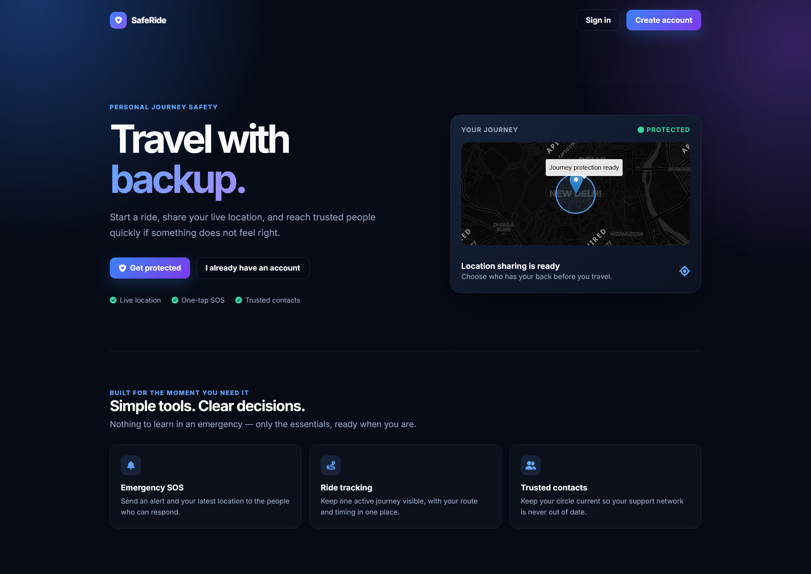
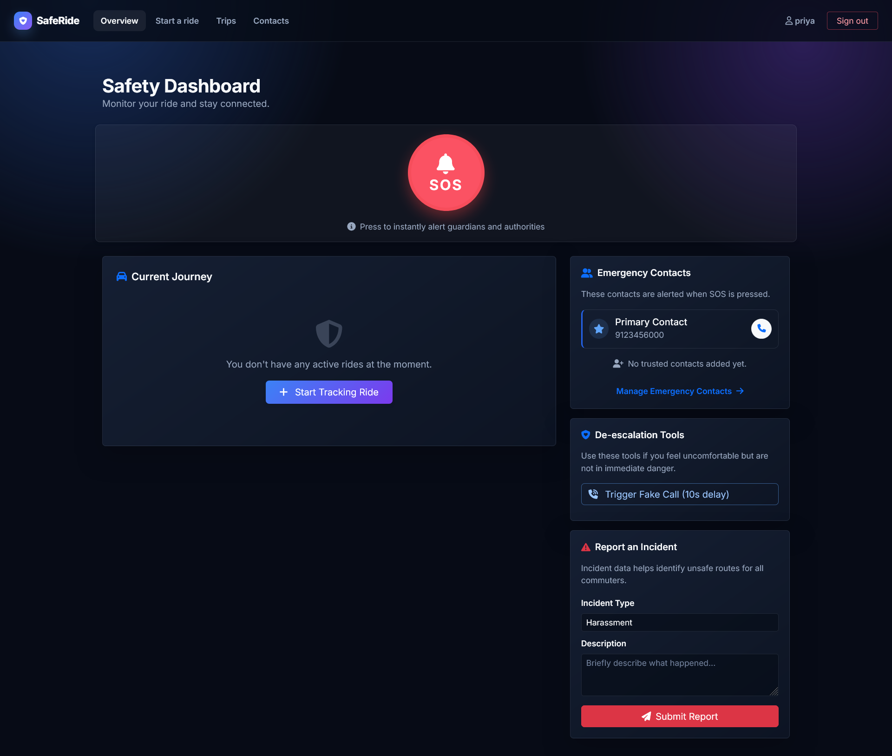

# SafeRide — Women's Safety Analytics Platform

<p align="center">
  
  
  
  
</p>

A **full-stack women's safety web application** built with Django that combines real-time SOS alerting, live GPS tracking, and incident reporting with machine learning (K-Means clustering + Logistic Regression) to identify unsafe routes and predict incident probability.

---

## Screenshots

| Landing Page | Commuter Dashboard |
|---|---|
|  |  |

---

## Features

| Feature | Description |
|---|---|
| 🚨 **One-Tap SOS Alerts** | Instant emergency alerts pushed to assigned guardians. Guardians can accept, decline, or resolve from a live dashboard. |
| 📍 **Live GPS Tracking** | Real-time location tracking via the Geolocation API, synced to the backend and rendered on an interactive Leaflet.js map. |
| 🗺️ **Hazard Zone Detection** | K-Means clustering on historical incident coordinates to identify High / Medium / Low risk zones — visualised as circles on the map. |
| 📊 **Incident Probability** | Logistic Regression model predicts the probability of an incident based on time-of-day and location — displayed live on the dashboard. |
| 🔔 **Incident Reporting** | File reports (Harassment, Theft, Suspicious Activity, etc.) that feed directly into the ML analytics pipeline. |
| 📱 **Fake Call Tool** | 10-second delayed fake incoming call overlay to help commuters de-escalate uncomfortable situations discreetly. |
| 🛡️ **Guardian Dashboard** | Admin portal with live SOS alerts, hazard zone maps, incident trend charts, and real-time stats. |
| 👥 **Trusted Contacts** | Add up to 3 trusted contacts who are alerted when SOS is triggered. |
| 🕐 **Trip History** | Full ride history with dates, routes, vehicle info, and linked incidents. |
| 🔌 **REST API** | DRF-powered API for rides, SOS, incidents, and analytics endpoints with authentication and ownership filtering. |

---

## Tech Stack

| Layer | Technologies |
|---|---|
| **Backend** | Django 5.1, Django REST Framework, Python 3.13 |
| **ML / Analytics** | scikit-learn (K-Means, Logistic Regression), pandas, NumPy |
| **Frontend** | HTML5, CSS3 (Inter font, solid design system), Bootstrap 5.3, Leaflet.js, Chart.js, Font Awesome 6 |
| **Database** | SQLite (dev) — swappable via `DATABASE_URL` to PostgreSQL / MySQL |
| **Security** | Environment-based secrets, `IsAuthenticated` on all API endpoints, CSRF protection, rate-limited SOS, WhiteNoise static serving |

---

## Project Structure

```
Saferide/
├── manage.py                       # Django management entry point
├── urls.py                         # Root URL routing
├── wsgi.py                         # WSGI application entry point
├── asgi.py                         # ASGI application entry point
├── utils.py                        # Shared utilities (coordinate validation)
│
├── settings/                       # Split settings (base → dev / prod)
│   ├── __init__.py
│   ├── base.py                     # Shared configuration
│   ├── development.py              # Local-dev overrides (DEBUG, SQLite)
│   └── production.py               # Hardened production settings
│
├── user/                           # Commuter-facing app
│   ├── models.py                   # Commuter, RideDetails, SOSRequest, IncidentReport, TrustedContact
│   ├── views.py                    # Dashboard, SOS, rides, contacts, profile, location tracking
│   ├── api.py                      # DRF ViewSets (Ride, SOS, Incident)
│   ├── serializers.py              # DRF Serializers
│   ├── admin.py                    # Django admin registration
│   ├── urls.py                     # User URL patterns
│   └── tests.py                    # Unit tests
│
├── admin_app/                      # Guardian / Admin app
│   ├── models.py                   # Guardian, GuardianResponse models
│   ├── views.py                    # Guardian dashboard, SOS accept/decline/resolve
│   ├── admin.py                    # Django admin registration
│   ├── urls.py                     # Guardian URL patterns
│   └── tests.py                    # Unit tests
│
├── analytics_app/                  # ML analytics pipeline
│   ├── services.py                 # AnalyticsService: K-Means, Logistic Regression, caching
│   ├── api.py                      # HazardZoneAPI, IncidentProbabilityAPI
│   ├── urls.py                     # Analytics URL patterns
│   ├── tests.py                    # Unit tests
│   └── management/commands/
│       └── generate_dummy_data.py  # Synthetic data generator
│
├── templates/                      # All HTML templates
│   ├── user/                       # Commuter templates (dashboard, SOS status, trips, etc.)
│   └── admin_app/                  # Guardian templates (dashboard, SOS details, etc.)
│
├── assets/                         # Static files (CSS, JS, images)
├── requirements.txt                # Python dependencies
├── .gitignore                      # Git ignore rules
└── .env.example                    # Environment variable template
```

---

## Setup & Installation

### Prerequisites

- Python 3.11+
- pip

### Quick Start

```bash
# 1. Clone the repository
git clone https://github.com/Chiranthan248/Saferide.git
cd Saferide

# 2. Create and activate a virtual environment
python -m venv .venv

# Windows
.venv\Scripts\activate
# macOS / Linux
source .venv/bin/activate

# 3. Install dependencies
pip install -r requirements.txt

# 4. Set up environment variables
cp .env.example .env
# Edit .env and set a unique SECRET_KEY

# 5. Apply database migrations
python manage.py makemigrations
python manage.py migrate

# 6. Generate sample data (required for analytics demo)
python manage.py generate_dummy_data

# 7. Create a superuser (for Django admin panel)
python manage.py createsuperuser

# 8. Start the development server
python manage.py runserver
```

### Application URLs

| URL | Description |
|---|---|
| `http://127.0.0.1:8000/` | Landing page |
| `http://127.0.0.1:8000/login/` | Commuter login |
| `http://127.0.0.1:8000/register/` | Commuter registration |
| `http://127.0.0.1:8000/dashboard/` | Commuter safety dashboard |
| `http://127.0.0.1:8000/guardian/login/` | Guardian login |
| `http://127.0.0.1:8000/guardian/dashboard/` | Guardian analytics dashboard |
| `http://127.0.0.1:8000/admin/` | Django admin panel |
| `http://127.0.0.1:8000/api/` | REST API browser |

---

## API Reference

All endpoints require authentication. Browse interactively at `/api/`.

### Ride Tracking
| Method | Endpoint | Description |
|--------|----------|-------------|
| `GET` | `/api/ride/` | List user's rides |
| `POST` | `/api/ride/` | Create a new ride |
| `PATCH` | `/api/ride/{id}/location/` | Update live GPS coordinates |

### SOS Alerts
| Method | Endpoint | Description |
|--------|----------|-------------|
| `GET` | `/api/sos/` | List user's SOS requests |
| `POST` | `/api/sos/` | Trigger a new SOS alert |

### Incident Reporting
| Method | Endpoint | Description |
|--------|----------|-------------|
| `GET` | `/api/incident/` | List user's incidents |
| `POST` | `/api/incident/` | Submit a new incident report |

### Analytics (ML)
| Method | Endpoint | Description |
|--------|----------|-------------|
| `GET` | `/analytics/api/hazard-zones/` | K-Means clustered hazard zones with risk levels |
| `GET` | `/analytics/api/incident-probability/?lat=&lng=&hour=` | Predicted incident probability (%) |

---

## Analytics Pipeline

### 1. Hazard Zone Detection (K-Means Clustering)

Clusters historical incident coordinates into **High / Medium / Low** risk zones. Visualised as coloured circles on the Leaflet.js map in both commuter and guardian dashboards.

```python
zones = AnalyticsService.identify_hazard_zones(n_clusters=5)
# → [{'id': 0, 'lat': 28.63, 'lng': 77.22, 'incident_count': 12, 'risk_level': 'High'}, ...]
```

### 2. Incident Probability (Logistic Regression)

Binary classifier trained on `hour`, `lat`, `lng` features. Returns real-time risk percentage displayed on the commuter dashboard during active rides.

```python
prob = AnalyticsService.predict_incident_probability(model, scaler, hour=22, lat=28.61, lng=77.21)
# → 73.5 (%)
```

### 3. Model Caching

Trained models are cached for 1 hour using Django's cache framework — no per-request retraining.

---

## Testing

The project includes a comprehensive test suite covering authentication, SOS workflows, ride management, and API security.

```bash
python manage.py test user.tests admin_app.tests analytics_app.tests
```

---

## Environment Variables

| Variable | Required | Default | Description |
|----------|----------|---------|-------------|
| `SECRET_KEY` | **Yes** | — | Django secret key (generate with `django.core.management.utils.get_random_secret_key()`) |
| `DEBUG` | No | `True` | Enable debug mode |
| `ALLOWED_HOSTS` | No | `127.0.0.1,localhost` | Comma-separated allowed hosts |
| `DATABASE_URL` | No | SQLite | PostgreSQL/MySQL connection string |
| `EMAIL_HOST` | No | — | SMTP host for email alerts |
| `EMAIL_PORT` | No | — | SMTP port |
| `EMAIL_USE_TLS` | No | — | Enable TLS for email |
| `EMAIL_HOST_USER` | No | — | SMTP username |
| `EMAIL_HOST_PASSWORD` | No | — | SMTP password |

See [`.env.example`](.env.example) for a ready-to-use template.